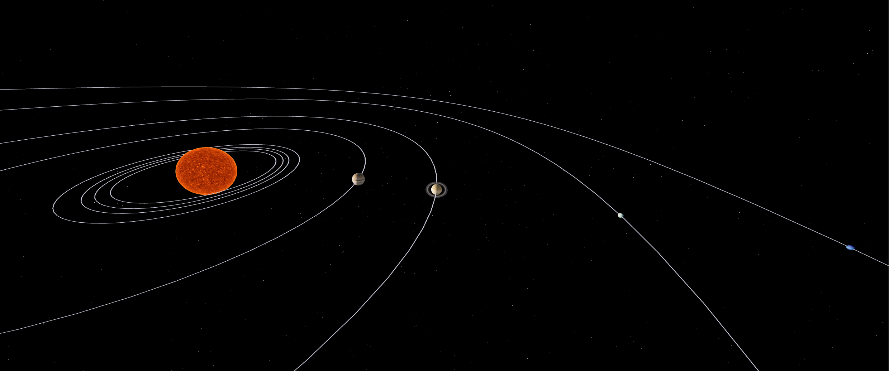
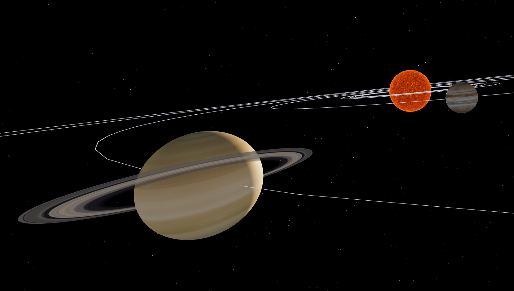
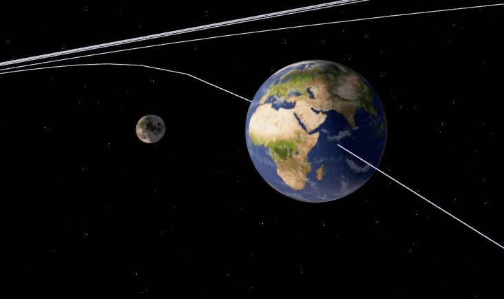

<div align="center">
  <h1>Solar system with React-three-fiber</h1>
  <p>A full 3D real-time solar system you can explore and enjoy the planets rotating around the Sun.</p>
</div>

## The Project

This project goal is to make a fully interactive solar system where you can freely navigate between each planets and display informations about it.
I love space and astronomy so i found it was a good idea to make my own solar system.

## Tech/Famework used

- React 18
- ThreeJS
- React-three-fiber
- React-three-drei

#### React-three-fiber as R3F

R3F combines the power of ThreeJS with the component logic of React. It allows you to create component that react to state with ThreeJS element such as mesh, geometry or material that are expressed in JSX.
R3F has a bunch of custom hooks such as useFrame() for renderer-loop or useLoader() for loading texture or model.

Let's see an example that comes from R3F

```Javascript
import ReactDOM from 'react-dom'
import React, { useRef, useState } from 'react'
import { Canvas, useFrame } from '@react-three/fiber'

function Box(props) {
  // This reference will give us direct access to the mesh
  const mesh = useRef()
  // Set up state for the hovered and active state
  const [hovered, setHover] = useState(false)
  const [active, setActive] = useState(false)
  // Subscribe this component to the render-loop, rotate the mesh every frame
  useFrame((state, delta) => (mesh.current.rotation.x += 0.01))
  // Return view, these are regular three.js elements expressed in JSX
  return (
    <mesh
      {...props}
      ref={mesh}
      scale={active ? 1.5 : 1}
      onClick={(event) => setActive(!active)}
      onPointerOver={(event) => setHover(true)}
      onPointerOut={(event) => setHover(false)}
    >
      <boxGeometry args={[1, 1, 1]} />
      <meshStandardMaterial color={hovered ? 'hotpink' : 'orange'} />
    </mesh>
  )
}

ReactDOM.render(
  <Canvas>
    <ambientLight />
    <pointLight position={[10, 10, 10]} />
    <Box position={[-1.2, 0, 0]} />
    <Box position={[1.2, 0, 0]} />
  </Canvas>,
  document.getElementById('root')
)
```

#### React-three-drei

Drei is a collection of useful helpers and abstractions for R3F

## What's done ?

- [x] Homepage
- [x] Solar System
  - [x] Sun -> With nice shaders
  - [x] Mercury
  - [x] Venus
  - [x] Earth
    - [x] Moon
  - [x] Mars
  - [x] Jupiter
  - [x] Saturn with rings
  - [x] Uranus
  - [x] Neptune
- [x] Eliptic orbit line

## What's next

- Add the Asteroids belt (maybe with Ceres)
- Add the ability to click on planet and follow it
- Add a panel with information about the planet which is focused

## Enjoy the view






